# 2025

# 人力资源白皮书

# 薪酬调查报告

# 202511版薪酬报告全新上线

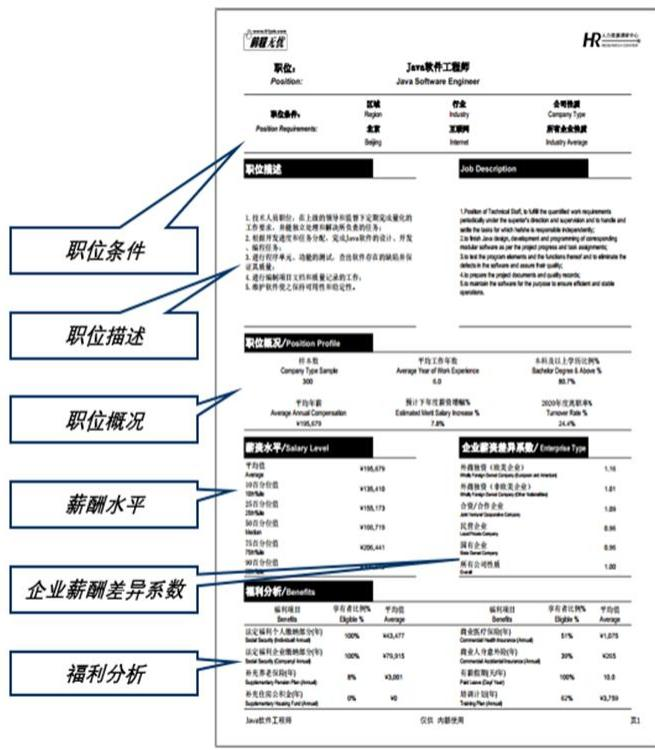

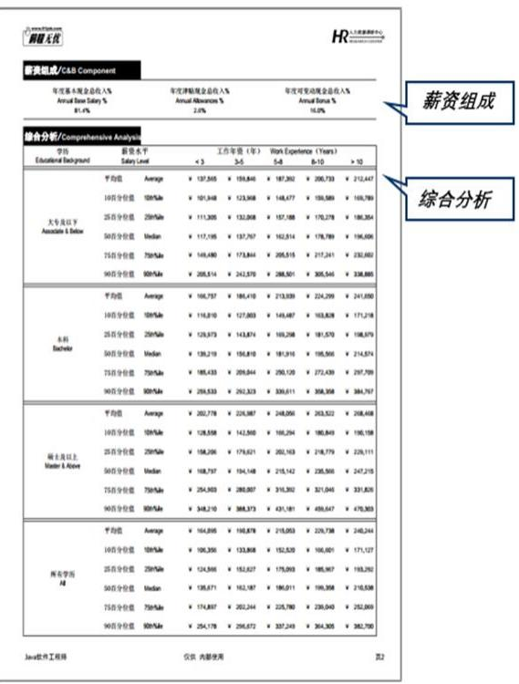

# 《前程无忧薪酬调查报告》特点

$\spadesuit$ 购买灵活，节约成本 :一个职位起售，按需购买，减少不必要支出；  
$\spadesuit$ 分类详尽，使用方便：薪酬数据细化到学历和工作年限交叉分析；包含年薪、薪资构成、福利等多种维度；  
$\spadesuit$ 覆盖面广，选择多样：薪酬报告覆盖 29 座城市，32 个行业大类， $8 0 0 +$ 职位；  
$\spadesuit$ 职位精准匹配，报告参考性高：购买前对职位进行精准匹配，包括城市、行业、工作内容等，确保职位数据参考性更高。

# 目录

# CONTENNTS

# 一、人才流动与招聘趋势篇 4

整体招聘趋势 5

人员流动情况 7

# 二、薪酬福利篇 10

宏观收入数据 11

年度薪酬数据 14

调薪情况解析 17

福利情况解析 19

# 三、培训发展篇 20

企业培训情况 21

员工晋级情况 22

# 四、应届生篇 23

就业意愿分析 24

招聘情况分析 25

离职情况分析 26

起薪与调薪情况 27

# 五、行业观察篇 28

人工智能、大数据、云计算行业 29

机械设备制造行业 30

能源化工行业 31

# 六、2025年HR大事记 32

政策速览 33

年度热词 35

# 关于我们 37

# 人才流动

# 与招聘趋势篇

# 整体招聘趋势

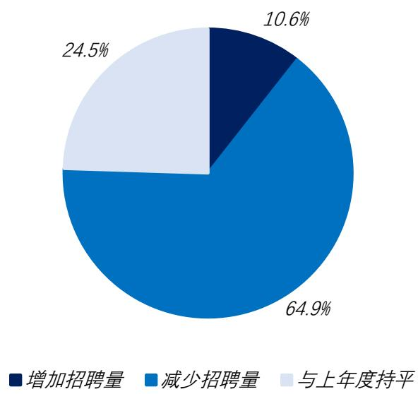  
招聘需求变化情况

2025年，经济增长面临一定压力，部分行业显现出周期调整迹象。调研数据显示，企业整体招聘需求有所下降，选择减少招聘的企业占比最高，达到 $6 4 . 9 \% \cdot$ ；与上年持平企业占比为$2 4 . 5 \% \mathrm { , }$ ；选择扩大招聘的企业仅占10.6%。

# 招聘计划完成率

2025年各级别岗位招聘计划完成率普遍提高，其中经理级别岗位完成率为 $7 6 . 3 \%$ ，主管级 $8 9 . 6 \%$ ，员工级$9 6 . 8 \%$ 。分析认为，当前市场人才供给增加，企业选择余地更大，因此招聘计划完成率有所提高。

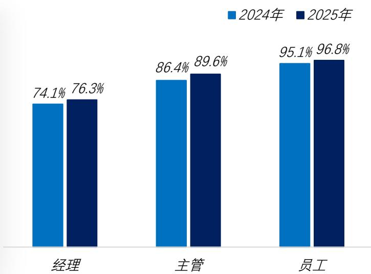

# 整体招聘趋势

# 招聘周期

2025年企业招聘周期较2024年有所延长。数据显示，经理、主管、员工招聘周期分别为61天、40天、22天。

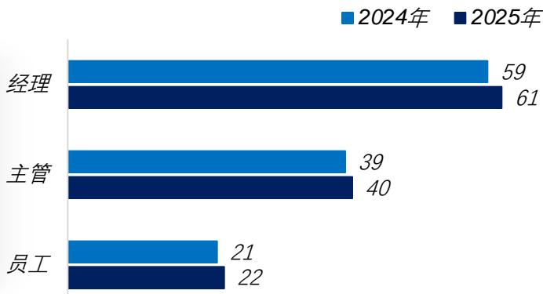

# 试用期通过率

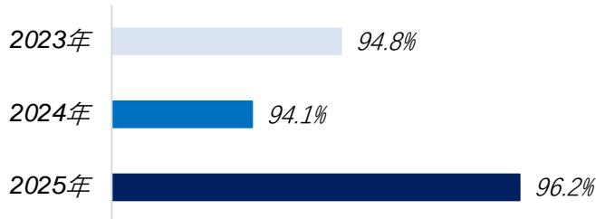

企业采取更审慎的招聘策略，在甄选环节提升了人岗匹配精度，2025年试用期通过率达 $9 6 . 2 \%$ ，较2024年的94.1%提升2.1个百分点。

# 招聘渠道分布情况

<table><tr><td>企业招聘人员来源渠道构成</td><td>2025年</td></tr><tr><td>网络招聘</td><td>67.1%</td></tr><tr><td>新媒体招聘</td><td>8.6%</td></tr><tr><td>内部推荐</td><td>8.5%</td></tr><tr><td>校园招聘</td><td>6.1%</td></tr><tr><td>人才市场/线下招聘</td><td>4.0%</td></tr><tr><td>猎头</td><td>3.5%</td></tr><tr><td>其他</td><td>2.2%</td></tr></table>

数据显示，2025年网络招聘仍为企业主要招聘渠道，占比为67.1%。值得注意的是，内部推荐的比例较上年度 $( 4 . 9 \% )$ ）明显提高，分析认为，在企业人才需求有所收窄趋势下，内部推荐以其高确定性、低成本和高效率的优势，成为企业控制风险、精准获取核心人才的重要渠道。

数据来源：前程无忧人力资源调研中心

# 人员流动情况

# 整体离职率

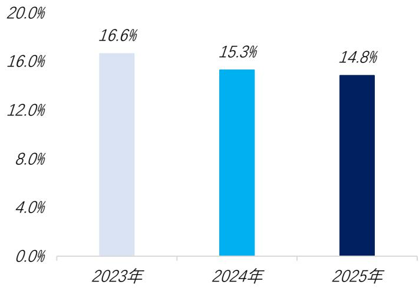

调研数据显示，2025年员工整体离职率为 $1 4 . 8 \%$ ，较上年度下降0.5个百分点，人员流动性进一步降低。

分析认为，2025年外部经济环境不确定性依然较强，全球经济与科技加速变革，行业结构性调整压力浮现，多数行业增长趋缓，企业倾向于控制成本、谨慎扩张，招聘重点从“扩规模”转向“优结构、提质量”，整体招聘需求下降，市场活力减弱，整体离职率持续降低。

# 主动离职率

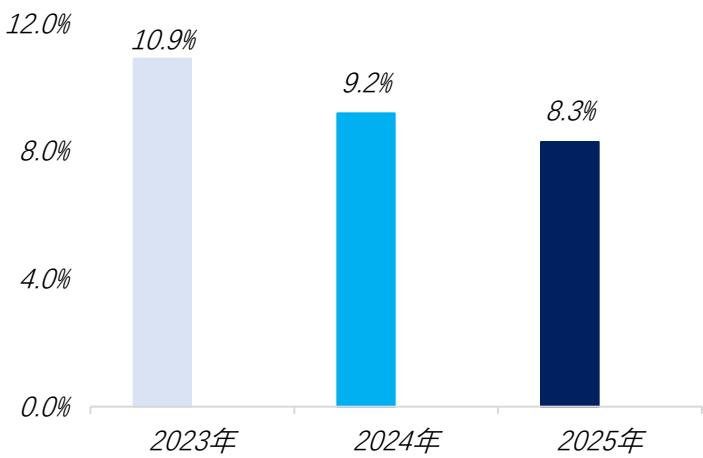

调研数据显示，2025年员工主动离职率为 $8 . 3 \%$ ，较上年度下降0.9个百分点，人员活跃度进一步下降。

在复杂经济环境大背景下，招聘市场活跃度有所降低，新增优质岗位相对有限，就业压力导致求职者信心下降；加之企业经营压力日益增加，导致职场避险心态增强，因此员工从“主动求变”转向“稳守当前”，主动离职率进一步降低。

数据来源：前程无忧人力资源调研中心

《2026离职与调薪调研报告》

# 人员流动情况

离职率行业差异性分析  

<table><tr><td>行业</td><td>2024年</td><td>2025年</td></tr><tr><td>全行业</td><td>15.3%</td><td>14.8%</td></tr><tr><td>餐饮/酒店/旅游</td><td>16.7%</td><td>16.5%</td></tr><tr><td>制造业</td><td>15.7%</td><td>15.7%</td></tr><tr><td>房地产</td><td>15.9%</td><td>15.4%</td></tr><tr><td>文体/教育/传媒</td><td>15.8%</td><td>15.4%</td></tr><tr><td>高科技</td><td>16.1%</td><td>15.3%</td></tr><tr><td>消费品</td><td>15.5%</td><td>15.2%</td></tr><tr><td>贸易/批发零售</td><td>15.3%</td><td>15.2%</td></tr><tr><td>能源化工</td><td>14.1%</td><td>14.1%</td></tr><tr><td>交通/运输/物流</td><td>15.4%</td><td>14.0%</td></tr><tr><td>汽车</td><td>14.2%</td><td>13.9%</td></tr><tr><td>医药健康</td><td>13.6%</td><td>13.7%</td></tr><tr><td>金融</td><td>13.8%</td><td>13.3%</td></tr></table>

数据显示，2025年多数行业整体离职率呈现微降趋势。从具体行业看， 2025年餐饮/酒店/旅游行业整体离职率为 $1 6 . 5 \%$ ，流动率略有下降，但仍居首位。

分析认为，作为劳动密集型产业的典型代表，餐饮/酒店/旅游行业的岗位大多可替代性强，基层员工薪酬福利普遍偏低，人员流动性普遍较高，即便在“求稳”大环境下，离职率仍居榜首。

# 人员流动情况

  
离职率城市差异性分析

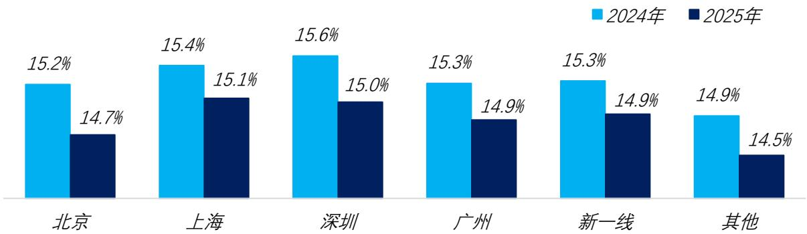

数据显示，2025年各城市离职率较2024年均有不同程度下降。新一线城市$( 1 4 . 9 \% )$ ）与一线城市离职率差距进一步缩小。分析认为，随着产业转移和区域经济均衡发展战略的推进，新一线城市特色产业集群不断培育和发展，城市人才吸纳能力不断增强，人才市场的活跃度和流动性基本与一线城市看齐。

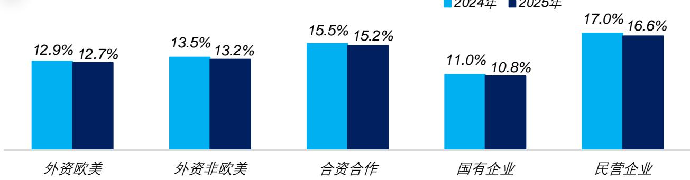  
离职率企业性质差异性分析

数据显示，2025年不同性质企业离职率均较2024年呈现下降趋势，其中民营企业离职率较去年下降0.4个百分点，降幅最为明显。分析认为，受当前环境因素直接影响，民营企业整体处于结构调整阶段，市场释放出的高薪、核心岗位减少，企业求效，员工求稳，人员流动性持续下降。在不同性质企业中，国有企业离职率（ $( 1 0 . 8 \% )$ ）远低于市场水平，国有企业经营的稳定性和福利保障的健全性在经济不确定性时期吸引力凸显。

数据来源：前程无忧人力资源调研中心

《2026离职与调薪调研报告》

# 薪酬福利篇

# 宏观收入数据

  
2023年至2025年居民人均可支配收入

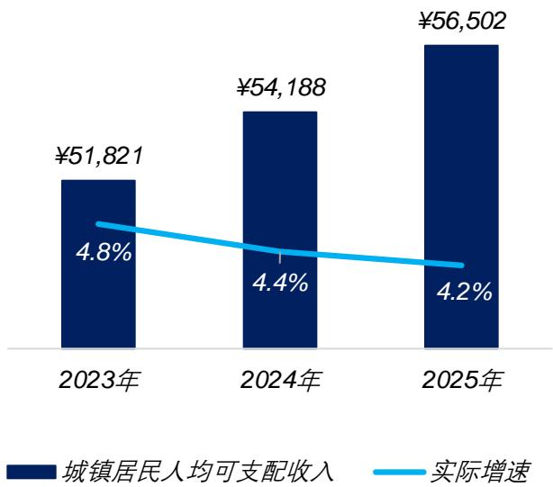

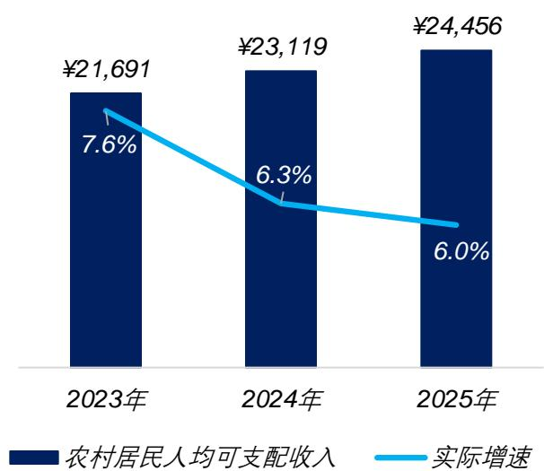

2023-2025城镇居民人均可支配收入呈逐年上升趋势，2025年城镇居民人均可支配收入达到56502元，扣除价格增长因素，2025年同比实际增长幅度为 $4 . 2 \%$ ，增幅略有缩窄。（单位：元/人·年）

2023-2025年农村居民人均可支配收入呈持续上升趋势。2025年农村居民人均可支配收入为24456元，扣除价格增长因素，2025年同比实际增长幅度为 $6 . 0 \%$ ，增幅略有缩窄。（单位：元/人·年）

居民人均可支配收入：指居民可用于最终消费支出和储蓄的总和，即居民可用于自由支配的收入，既包括现金收入，也包括实物收入。按照收入的来源，可支配收入包括工资性收入、经营净收入、财产净收入和转移净收入。

居民人均可支配收入实际增速=[（ $\ b { 1 + }$ 居民人均可支配收入名义增速）/同期居民消费价格指数]-1

# 宏观收入数据

各地城镇居民人均可支配收入  

<table><tr><td>地区</td><td>城镇居民人均可支配收入</td><td>地区</td><td>城镇居民人均可支配收入</td></tr><tr><td>全国</td><td>¥56,502</td><td>广东</td><td>¥63,974</td></tr><tr><td>北京</td><td>¥96,292</td><td>昆明</td><td>¥57,444*</td></tr><tr><td>上海</td><td>¥96,842</td><td>长沙</td><td>¥69,658*</td></tr><tr><td>广州</td><td>¥83,436*</td><td>成都</td><td>¥65,098*</td></tr><tr><td>深圳</td><td>¥81,123*</td><td>重庆</td><td>¥49,778*</td></tr><tr><td>杭州</td><td>¥86,640</td><td>武汉</td><td>¥64,346*</td></tr><tr><td>南京</td><td>¥83,084*</td><td>济南</td><td>¥65,364*</td></tr><tr><td>苏州</td><td>¥86,640*</td><td>合肥</td><td>¥62,685*</td></tr><tr><td>无锡</td><td>¥80,003*</td><td>郑州</td><td>¥50,494*</td></tr><tr><td>宁波</td><td>¥83,110*</td><td>长春</td><td>¥42,350*</td></tr><tr><td>天津</td><td>¥60,099</td><td>哈尔滨</td><td>¥48,216*</td></tr><tr><td>西安</td><td>¥53,678*</td><td>大连</td><td>¥56,212*</td></tr><tr><td>厦门</td><td>¥79,719</td><td>沈阳</td><td>¥56,117*</td></tr><tr><td>福州</td><td>¥60,758*</td><td>青岛</td><td>¥68,813*</td></tr><tr><td>东莞</td><td>¥69,769*</td><td>南昌</td><td>¥57,294*</td></tr></table>

城镇居民人均可支配收入：指反映居民家庭全部现金收入能用于安排家庭日常生活的那部分收入。它是家庭总收入扣除缴纳的所得税、个人缴纳的社会保障费以及调查户的记账补贴后的收入。（单位：元/人·年）

以上数据截止日期为2026年1月28日， $\star _ { \ast }$ 表示暂未更新2025年相关数据，仍为2024年数据。

# 宏观收入数据

各地最低工资标准  

<table><tr><td>地区</td><td>标准实施日期</td><td>最低工资标准</td><td>地区</td><td>标准实施日期</td><td>最低工资标准</td></tr><tr><td>北京</td><td>2025-09-01</td><td>¥2,540</td><td>昆明</td><td>2025-10-01</td><td>¥2,170</td></tr><tr><td>上海</td><td>2025-07-01</td><td>¥2,740</td><td>长沙</td><td>2025-09-01</td><td>¥2,200</td></tr><tr><td>广州</td><td>2025-03-01</td><td>¥2,500</td><td>成都</td><td>2025-01-01</td><td>¥2,330</td></tr><tr><td>深圳</td><td>2025-03-01</td><td>¥2,520</td><td>重庆</td><td>2025-01-01</td><td>¥2,330</td></tr><tr><td>杭州</td><td>2026-01-01</td><td>¥2,660</td><td>武汉</td><td>2025-12-01</td><td>¥2,400</td></tr><tr><td>南京</td><td>2026-01-01</td><td>¥2,660</td><td>济南</td><td>2025-10-01</td><td>¥2,400</td></tr><tr><td>苏州</td><td>2026-01-01</td><td>¥2,660</td><td>合肥</td><td>2025-09-01</td><td>¥2,320</td></tr><tr><td>无锡</td><td>2026-01-01</td><td>¥2,660</td><td>郑州</td><td>2025-12-01</td><td>¥2,350</td></tr><tr><td>宁波</td><td>2026-01-01</td><td>¥2,660</td><td>长春</td><td>2025-12-01</td><td>¥2,230</td></tr><tr><td>天津</td><td>2025-09-01</td><td>¥2,510</td><td>哈尔滨</td><td>2025-12-01</td><td>¥2,270</td></tr><tr><td>西安</td><td>2023-05-01</td><td>¥2,160</td><td>大连</td><td>2025-12-01</td><td>¥2,230</td></tr><tr><td>厦门</td><td>2025-04-01</td><td>¥2,265</td><td>沈阳</td><td>2025-12-01</td><td>¥2,230</td></tr><tr><td>福州</td><td>2025-04-01</td><td>¥2,195</td><td>青岛</td><td>2025-10-01</td><td>¥2,400</td></tr><tr><td>东莞</td><td>2025-03-05</td><td>¥2,080</td><td>南昌</td><td>2025-12-01</td><td>¥2,240</td></tr></table>

*各省市最低工资标准设有不同档次的，本报告均统计最高一档(单位：元/人·月)

# 宏观收入数据

2025年重点城市平均月薪（单位：元/月）  

<table><tr><td>城市</td><td>平均月薪</td><td>城市</td><td>平均月薪</td></tr><tr><td>上海</td><td>¥12,742</td><td>青岛</td><td>¥8,436</td></tr><tr><td>北京</td><td>¥12,518</td><td>重庆</td><td>¥8,367</td></tr><tr><td>深圳</td><td>¥11,865</td><td>武汉</td><td>¥8,308</td></tr><tr><td>广州</td><td>¥10,604</td><td>西安</td><td>¥8,246</td></tr><tr><td>杭州</td><td>¥10,165</td><td>合肥</td><td>¥8,052</td></tr><tr><td>南京</td><td>¥9,624</td><td>大连</td><td>¥7,945</td></tr><tr><td>苏州</td><td>¥9,586</td><td>长沙</td><td>¥7,882</td></tr><tr><td>宁波</td><td>¥9,483</td><td>福州</td><td>¥7,810</td></tr><tr><td>厦门</td><td>¥9,292</td><td>济南</td><td>¥7,762</td></tr><tr><td>无锡</td><td>¥9,243</td><td>昆明</td><td>¥7,638</td></tr><tr><td>成都</td><td>¥9,105</td><td>郑州</td><td>¥7,583</td></tr><tr><td>东莞</td><td>¥8,584</td><td>沈阳</td><td>¥7,514</td></tr><tr><td>天津</td><td>¥8,283</td><td>长春</td><td>¥7,092</td></tr></table>

2025年重点城市不同层级平均月薪（单位：元/月）  

<table><tr><td>城市</td><td>总监</td><td>经理</td><td>主管</td><td>员工</td></tr><tr><td>北京</td><td>¥35,683</td><td>¥23,464</td><td>¥12,605</td><td>¥9,975</td></tr><tr><td>上海</td><td>¥36,422</td><td>¥23,651</td><td>¥12,765</td><td>¥10,054</td></tr><tr><td>广州</td><td>¥32,221</td><td>¥19,856</td><td>¥11,129</td><td>¥9,065</td></tr><tr><td>深圳</td><td>¥34,259</td><td>¥21,635</td><td>¥12,280</td><td>¥9,703</td></tr><tr><td>杭州</td><td>¥29,965</td><td>¥18,562</td><td>¥10,896</td><td>¥8,265</td></tr><tr><td>南京</td><td>¥26,183</td><td>¥16,365</td><td>¥9,873</td><td>¥8,002</td></tr><tr><td>东莞</td><td>¥24,453</td><td>¥15,832</td><td>¥9,142</td><td>¥7,221</td></tr><tr><td>武汉</td><td>¥23,828</td><td>¥13,866</td><td>¥8,629</td><td>¥7,240</td></tr><tr><td>西安</td><td>¥22,623</td><td>¥13,115</td><td>¥8,402</td><td>¥7,058</td></tr><tr><td>成都</td><td>¥25,947</td><td>¥15,980</td><td>¥9,304</td><td>¥7,503</td></tr></table>

数据来源：前程无忧人力资源调研中心

# 宏观收入数据

重点行业热招职位平均年薪（单位：元/年）  

<table><tr><td>行业</td><td>职位</td><td>一线城市</td><td>非一线城市</td></tr><tr><td rowspan="5">电子/半导体/集成电路</td><td>集成电路设计工程师</td><td>¥400,591</td><td>¥350,132</td></tr><tr><td>FPGA工程师</td><td>¥390,516</td><td>¥321,658</td></tr><tr><td>嵌入式软件开发工程师</td><td>¥304,258</td><td>¥220,823</td></tr><tr><td>硬件工程师</td><td>¥249,021</td><td>¥183,493</td></tr><tr><td>结构工程师</td><td>¥229,863</td><td>¥169,136</td></tr><tr><td rowspan="5">互联网</td><td>产品经理（IT）</td><td>¥386,153</td><td>¥305,632</td></tr><tr><td>算法工程师</td><td>¥372,629</td><td>¥269,048</td></tr><tr><td>Android开发工程师</td><td>¥294,853</td><td>¥236,415</td></tr><tr><td>网络安全工程师</td><td>¥270,892</td><td>¥164,531</td></tr><tr><td>搜索引擎优化工程师</td><td>¥240,658</td><td>¥161,026</td></tr><tr><td rowspan="5">计算机</td><td>云计算架构师</td><td>¥491,253</td><td>¥423,052</td></tr><tr><td>全栈开发工程师</td><td>¥295,236</td><td>¥231,523</td></tr><tr><td>大数据工程师</td><td>¥315,965</td><td>¥273,258</td></tr><tr><td>软件测试工程师</td><td>¥228,694</td><td>¥176,931</td></tr><tr><td>技术服务工程师</td><td>¥186,193</td><td>¥149,364</td></tr><tr><td rowspan="5">机械设备制造</td><td>自动化工程师</td><td>¥235,291</td><td>¥156,532</td></tr><tr><td>机械工程师</td><td>¥218,426</td><td>¥150,216</td></tr><tr><td>焊接工程师</td><td>¥169,462</td><td>¥124,268</td></tr><tr><td>现场应用工程师</td><td>¥176,536</td><td>¥135,147</td></tr><tr><td>数控操机</td><td>¥109,628</td><td>¥90,153</td></tr><tr><td rowspan="5">汽车</td><td>算法工程师</td><td>¥384,258</td><td>¥296,203</td></tr><tr><td>汽车设计工程师</td><td>¥278,683</td><td>¥167,320</td></tr><tr><td>汽车装配工艺工程师</td><td>¥210,874</td><td>¥136,659</td></tr><tr><td>供应商质量工程师</td><td>¥180,942</td><td>¥111,453</td></tr><tr><td>汽车质量工程师</td><td>¥158,622</td><td>¥130,146</td></tr></table>

数据来源：前程无忧人力资源调研中心

《薪酬调查报告》

# 宏观收入数据

重点行业热招职位平均年薪（单位：元/年）  

<table><tr><td>行业</td><td>职位</td><td>一线城市</td><td>非一线城市</td></tr><tr><td rowspan="5">金融</td><td>投资经理</td><td>¥397,297</td><td>¥309,704</td></tr><tr><td>基金分析师</td><td>¥340,502</td><td>¥264,885</td></tr><tr><td>风险控制专员</td><td>¥241,304</td><td>¥174,568</td></tr><tr><td>理财顾问</td><td>¥216,453</td><td>¥148,759</td></tr><tr><td>融资专员</td><td>¥189,540</td><td>¥123,958</td></tr><tr><td rowspan="5">生物/医药</td><td>生物信息工程师</td><td>¥293,820</td><td>¥188,605</td></tr><tr><td>药物合成研究员</td><td>¥279,563</td><td>¥183,916</td></tr><tr><td>蛋白纯化研究员</td><td>¥222,310</td><td>¥146,638</td></tr><tr><td>药品注册员</td><td>¥207,837</td><td>¥132,083</td></tr><tr><td>药品市场推广</td><td>¥171,654</td><td>¥126,283</td></tr><tr><td rowspan="5">贸易/进出口</td><td>外贸专员</td><td>¥167,943</td><td>¥119,460</td></tr><tr><td>高级业务跟单</td><td>¥211,275</td><td>¥158,548</td></tr><tr><td>业务跟单</td><td>¥138,160</td><td>¥92,206</td></tr><tr><td>物流专员</td><td>¥126,043</td><td>¥82,257</td></tr><tr><td>单证员</td><td>¥106,834</td><td>¥71,326</td></tr><tr><td rowspan="5">能源/化工</td><td>材料工程师</td><td>¥206,480</td><td>¥146,952</td></tr><tr><td>精益生产工程师</td><td>¥187,384</td><td>¥134,115</td></tr><tr><td>生产工程师</td><td>¥156,323</td><td>¥119,781</td></tr><tr><td>环保工程师</td><td>¥194,634</td><td>¥141,256</td></tr><tr><td>EHS工程师</td><td>¥164,895</td><td>¥125,642</td></tr><tr><td rowspan="5">快速消费品</td><td>品牌经理</td><td>¥373,094</td><td>¥268,378</td></tr><tr><td>直播运营专员</td><td>¥142,865</td><td>¥107,851</td></tr><tr><td>电商运营专员</td><td>¥146,530</td><td>¥116,687</td></tr><tr><td>新媒体运营专员</td><td>¥130,140</td><td>¥94,826</td></tr><tr><td>市场通路专员</td><td>¥136,402</td><td>¥96,312</td></tr></table>

数据来源：前程无忧人力资源调研中心

《薪酬调查报告》

# 调薪情况解析

  
冻薪企业比例

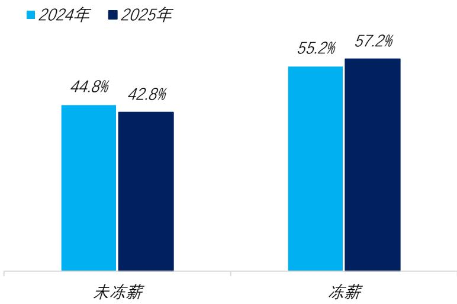

2025年，全球经济的复杂性与不确定性依然较强，企业在市场需求、成本管控及资金链等方面持续承压 ，在调薪策略上继续保持审慎。调研数据显示，2025年调薪企业比例进一步下降，占比仅为 $4 2 . 8 \%$ 。

# 企业调薪幅度情况

调研显示，2025年企业整体调薪幅度为4.1%，较上年度下降0.2个百分点。分析认为，面对持续的经济不确定性，企业盈利增长承压，普遍对未来业绩增长持谨慎态度，调薪预算进一步收紧。在“增长预期减弱、盈利压力增大”的大背景下，预计2026年企业调薪幅度进一步下降至 $4 . 0 \%$ 。

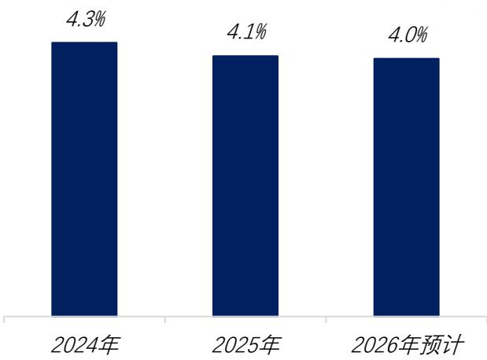  
数据来源：前程无忧人力资源调研中心《2026离职与调薪调研报告》

# 调薪情况解析

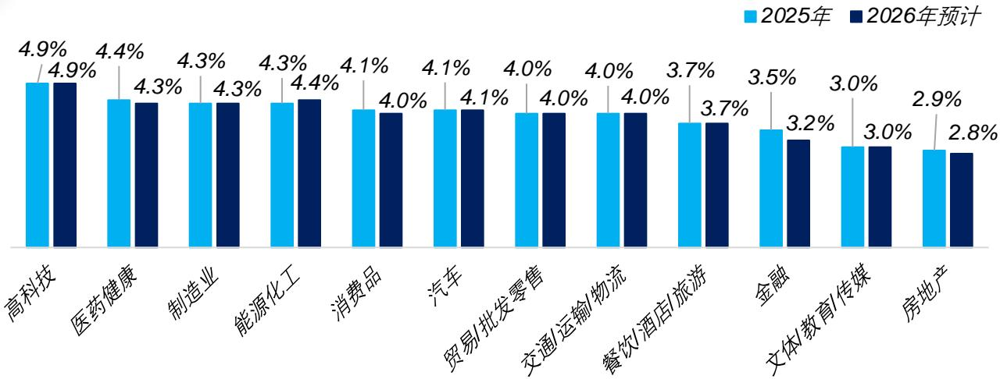  
不同行业企业调薪幅度情况

调研数据显示，2025年多数行业调薪幅度延续小幅下调态势。调薪幅度居于前三位的行业是高科技行业 $( 4 . 9 \% )$ ）、医药健康行业（4.4%）和制造业 $( 4 . 3 \% )$ ）。

高科技行业虽面临投融资环境波动，但在人工智能、半导体等政策推动下，对技术人才的刚性竞争使其调薪幅度整体处于高位。

预计2026年多数行业的调薪幅度将与2025年持平或小幅回落。

  
企业调薪幅度情况

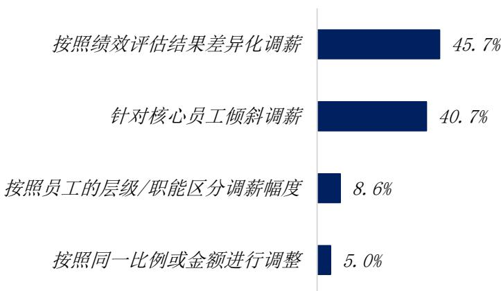

在调薪策略上，“按照绩效评估结果差异化调薪”和“针对核心员工倾斜调薪”已成为当前企业的两大主流选择，占比分别为45.7%和 $4 0 . 7 \% \cdot$ ；相比之下，选择 “按照员工的层级/职能区分调薪幅度”的企业占比仅为 $8 . 6 \% \cdot$ ；而实施全员“按照同一比例或金额进行调整”的企业占比最低，仅为 $5 . 0 \%$ 。

数据来源：前程无忧人力资源调研中心《2026离职与调薪调研报告》

# 福利情况解析

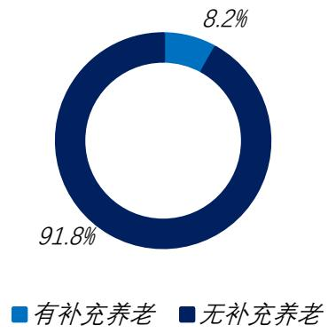  
一线城市福利情况

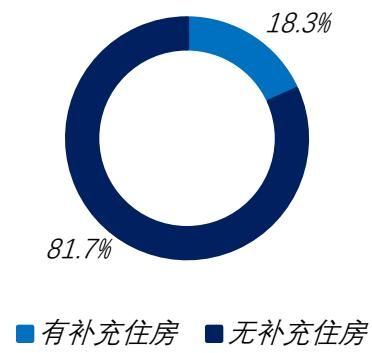

如上图数据显示，2025年一线城市中有8.2%的企业提供补充养老福利，18.3%的企业提供补充住房福利。

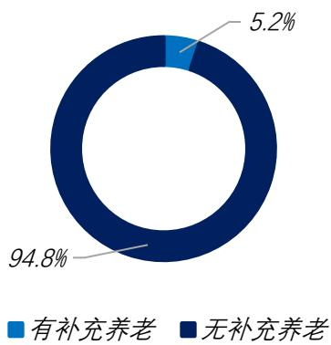  
非一线城市福利情况

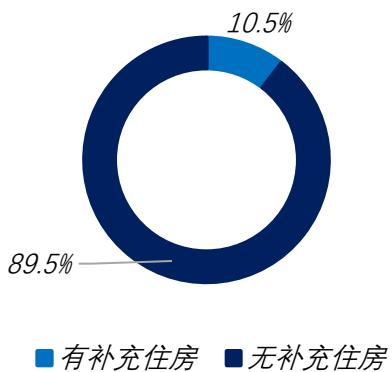

如上图数据所示，2025年非一线城市中有补充养老福利的企业占比为5.2%，有补充住房福利的企业占比为 $1 0 . 5 \%$ 。

# 培训发展篇

# 企业培训情况

# 人均培训投入

受经济下行压力影响，企业持续缩减培训支出。数据显示，2025年企业人均培训投入为1039元。

（单位：元/人·年）

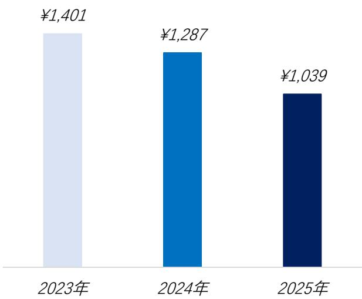

# 具体培训项目

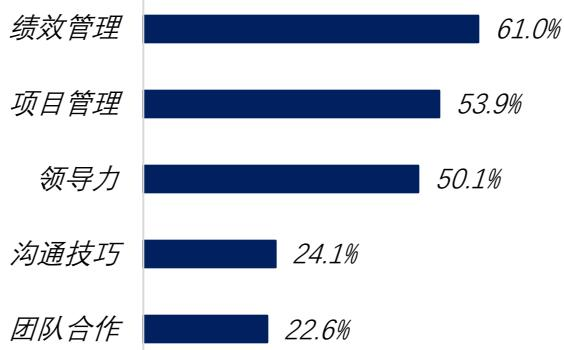  
管
理
人
员

数据显示，企业针对管理层的培训重点集中于绩效管理$( 6 1 . 0 \% )$ ）、项目管理（ $( 5 3 . 9 \% )$ 及领导力（50.1%）。

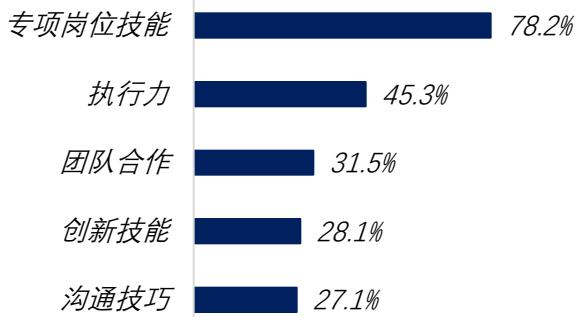  
普
通
员
工

数据显示，2025年企业针对普通员工培训项目主要集中于专项岗位技能方面，占比为 $7 8 . 2 \%$ 。

# 员工晋升情况

  
管理通道各层级晋升时间跨度

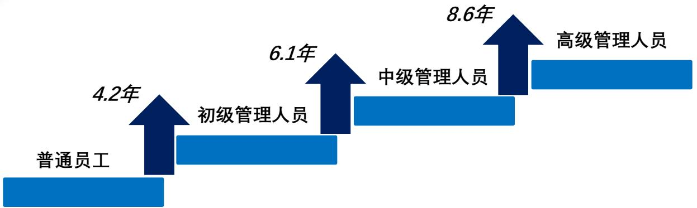

如上图所示，管理通道各层级晋升所需时间呈逐级上涨趋势。普通员工晋升初级管理人员、初级管理人员晋升中级管理人员、中级管理人员晋升高级管理人员的实际时间分别为4.2年、6.1年、8.6年。

  
专家通道各层级晋升时间跨度

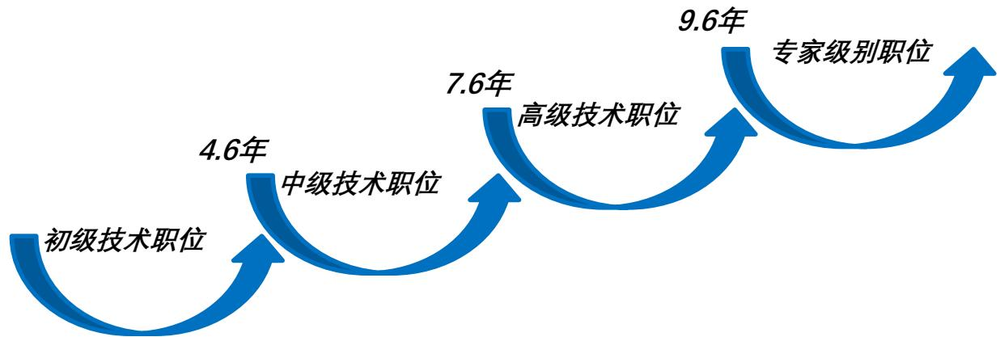

专业通道各层级的晋升时间遵循层级越高，实际升职时间越长的规律。初级技术职位晋升中级技术职位、中级技术职位晋升高级技术职位、高级技术职位晋升专业级别职位的实际时间分别为4.6年、7.6年、9.6年。

# 应届生篇

# 就业意愿解析

<table><tr><td>就业意愿</td><td>2025届</td><td>2026届</td></tr><tr><td>就业（计划去企业就业）</td><td>36.6%</td><td>36.2%</td></tr><tr><td>就业（计划考公务员/事业单位/教师等）</td><td>22.5%</td><td>25.1%</td></tr><tr><td>国内继续求学</td><td>27.3%</td><td>24.4%</td></tr><tr><td>国外继续求学</td><td>2.7%</td><td>2.5%</td></tr><tr><td>慢就业（暂无具体打算）</td><td>9.4%</td><td>10.3%</td></tr><tr><td>其他</td><td>1.5%</td><td>1.5%</td></tr></table>

整体来看，在宏观经济不确定性增强的背景下，毕业生求稳心态加剧，2026届毕业生“计划考公务员/事业单位/教师等”比例达到 $2 5 . 1 \%$ ，较上届上升2.6个百分点；受部分企业收缩招聘需求等因素影响，应届生企业就业意愿有所降低，占比小幅回落至 $3 6 . 2 \% \cdot$ ；“慢就业”现象持续升温，占比为 $1 0 . 3 \%$ ，较上届提升0.9个百分点；同时，受就业竞争加剧与国际形势复杂化的双重影响，毕业生继续深造意愿整体走低，国内升学占比降至 $2 4 . 4 \%$ ，国外求学占比也收缩至 $2 . 5 \%$ 。

<table><tr><td>首选目标企业性质</td><td>2025届</td><td>2026届</td></tr><tr><td>国有企业</td><td>43.2%</td><td>45.7%</td></tr><tr><td>机关/事业单位</td><td>26.6%</td><td>27.6%</td></tr><tr><td>民营企业</td><td>13.5%</td><td>10.7%</td></tr><tr><td>外资企业</td><td>13.1%</td><td>13.4%</td></tr><tr><td>合资企业</td><td>3.6%</td><td>2.6%</td></tr></table>

应届生意向就业企业数据显示，国有企业就业吸引力持续增强，占比增长2.5个百分点至$4 5 . 7 \%$ ；首选机关/事业单位的毕业生占比仅次于国有企业，为 $2 7 . 6 \% \cdot$ ；外资企业保持相对稳定，小幅上升0.3个百分点至 $1 3 . 4 \%$ ；而民营企业和合资企业分别下降2.8个和1.0个百分点，占比降至10.7%和 $2 . 6 \%$ 。分析认为，受经济恢复整体偏缓、就业市场信心不足等因素影响，毕业生更看重长期发展的稳定性，倾向于选择抗风险能力较强的国有企业及机关/事业单位。

数据来源：前程无忧人力资源调研中心

《2025应届生调研报告》

# 招聘情况分析

# 平均招聘成本

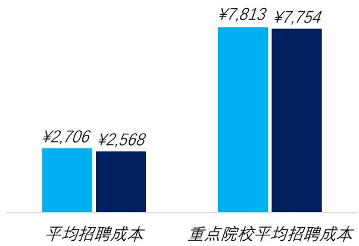  
■2025届■2026届预计

数据显示，企业校招人均招聘成本持续下降，2025届应届生人均招聘成本为2706元；仅在重点院校招聘2025届毕业生的企业人均招聘成本为7813元。分析认为，在宏观经济承压背景下，部分企业采取“降本增效”策略，缩减校招规模，降低了平均招聘成本。此外，一些企业采用数字技术优化招聘流程，通过视频面试、AI筛选等数字化途径，有效控制招聘成本。

签约率、履约率、转正率  

<table><tr><td>应届生类别</td><td>指标</td><td>2023届</td><td>2024届</td></tr><tr><td rowspan="3">整体平均</td><td>签约率</td><td>59.4%</td><td>61.3%</td></tr><tr><td>履约率</td><td>89.1%</td><td>92.5%</td></tr><tr><td>转正率</td><td>90.6%</td><td>91.8%</td></tr><tr><td rowspan="3">重点院校招聘</td><td>签约率</td><td>43.7%</td><td>47.7%</td></tr><tr><td>履约率</td><td>93.2%</td><td>93.8%</td></tr><tr><td>转正率</td><td>92.1%</td><td>92.7%</td></tr></table>

2024届重点院校毕业生的签约率、履约率和转正率较上届均有提升，与整体应届生就业市场趋势一致。对比应届生整体，重点院校招聘应届生签约率较低，但履约和转正率较高。分析认为，重点院校毕业生手握更多OFFER，追求“优质匹配”，就业决策更趋谨慎，签约率低于普通院校。但凭借高质量实习转化和岗位适配性，其履约率和转正率更高。

数据来源：前程无忧人力资源调研中心

《2025应届生调研报告》

# 离职情况分析

  
不同行业应届生离职率

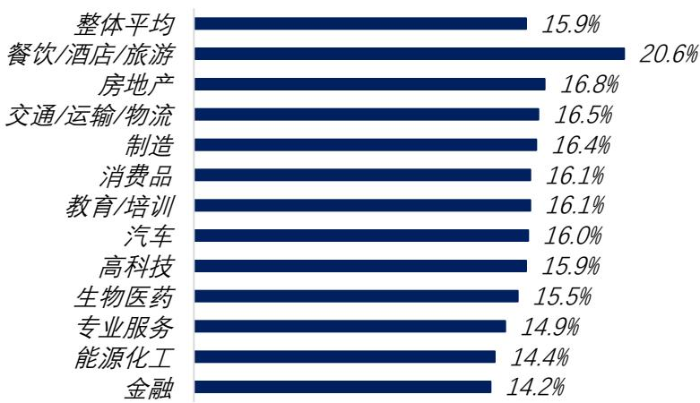

调研数据显示，2024届应届生整体离职率为 $1 5 . 9 \%$ ，餐饮/酒店/旅游、房地产、交通/运输/物流行业离职率相对较高，分别为 $2 0 . 6 \%$ 、 $1 6 . 8 \%$ 和$1 6 . 5 \% \mathrm { , }$ ；金融行业离职率最低，为 $1 4 . 2 \%$ 。

  
离职时间分布情况

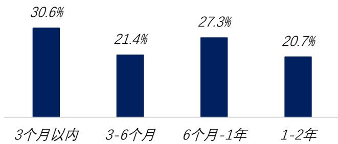

调研数据显示，应届生在入职3个月内离职比例相对较高，为 $3 0 . 6 \% \mathrm { ; }$ 其次是6个月-1年，离职比例达到27.3%。

  
离职原因分布情况

如图所示，应届生反馈的离职最主要三大原因是：薪酬福利缺乏竞争力（ $( 7 8 . 9 \% )$ ）、成长机会和空间有限$( 4 9 . 5 \% )$ ）、绩效考核不公正或者没有激励性（ $( 4 6 . 6 \% )$ ）。访谈表明，受外部复杂多变环境影响，毕业生求职更趋务实，薪酬福利成为其核心关注点。

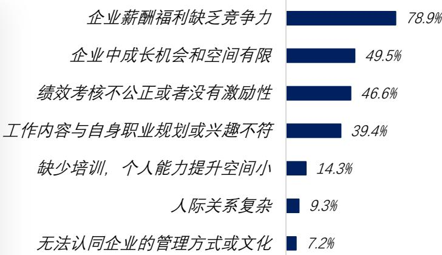  
数据来源：前程无忧人力资源调研中心《2025应届生调研报告》

# 起薪与调薪情况

主要城市应届生起薪水平  

<table><tr><td>城市</td><td>50分位</td><td>75分位</td></tr><tr><td>上海</td><td>¥7,681</td><td>¥9,437</td></tr><tr><td>北京</td><td>¥7,576</td><td>¥9,403</td></tr><tr><td>深圳</td><td>¥7,568</td><td>¥9,171</td></tr><tr><td>广州</td><td>¥6,845</td><td>¥8,056</td></tr><tr><td>杭州</td><td>¥6,671</td><td>¥7,946</td></tr><tr><td>南京</td><td>¥6,385</td><td>¥7,633</td></tr><tr><td>苏州</td><td>¥6,308</td><td>¥7,539</td></tr><tr><td>成都</td><td>¥6,109</td><td>¥7,203</td></tr><tr><td>武汉</td><td>¥5,901</td><td>¥6,952</td></tr><tr><td>西安</td><td>¥5,693</td><td>¥6,711</td></tr><tr><td>重庆</td><td>¥5,677</td><td>¥6,517</td></tr><tr><td>长沙</td><td>¥5,475</td><td>¥6,404</td></tr></table>

数据显示，一线城市企业提供给2025届应届生的薪酬水平相对较高，上海、北京、深圳、广州的应届生起薪中位值分别为7681元、7576元、7568元和6845元。

在新一线城市中，长三角地区经济发展水平较高，特色产业集聚发展，杭州、南京和苏州应届生起薪相对较高，其起薪中位值分别为6671元、6385元、6308元。

# 应届生起薪调整幅度

调研数据显示，对于2025届应届生，$5 0 . 5 \%$ 的企业选择提高起薪， $4 6 . 5 \%$ 的企业应届生起薪与上届保持一致， $3 . 0 \%$ 的企业选择下调起薪。在宏观经济不确定性增强与应届生供给创新高的双重压力下，企业薪酬策略趋于保守，

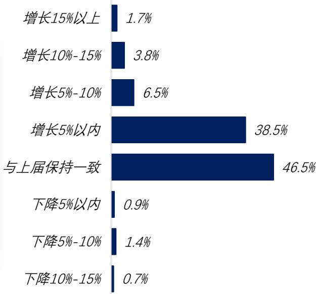

数据来源：前程无忧人力资源调研中心

《2025应届生调研报告》

五

# 行业观察篇

# 人工智能/大数据/云计算行业

# 整体离职率与去年持平

2025年人工智能/大数据/云计算行业的整体离职率为 $1 5 . 7 \%$ ，与2024年（ $( 1 5 . 8 \% )$ ）基本持平，高于全行业水平。分析认为，人工智能/大数据/云计算行业受“人工智能 $^ +$ ”行动政策驱动，技术落地加速，企业更注重核心人才留存，招聘需求从“规模扩张”转向“精准适配”，人才流动小幅收窄。不过，大模型、具身智能等关键领域人才缺口仍较为突出，行业人才活跃度高于全行业。

# 民营企业离职率最高

2025年，民营企业以16.9%的离职率位居首位，显著高于其他性质企业（11.1%-$1 3 . 9 \%$ ）。分析认为，作为人工智能/大数据/云计算行业场景创新与市场开拓的主力，民营企业聚焦垂直领域技术转化与商业化落地，同时面临行业竞争格局重塑与业务模式适配的双重挑战，在此背景下，企业需持续优化组织架构以适应变革，因此人才流动虽较上年微降但仍处于高位。

# 技术研发/专业技能人员调薪幅度领先

2025年技术研发/专业技能人员（ $( 7 . 0 \% )$ ）调薪幅度保持领先（其他类型员工调薪幅度位于 $2 . 8 \% - 5 . 5 \%$ 区间内）。分析认为，技术创新是人工智能/大数据/云计算行业企业发展的核心支撑，研发人员是技术落地与迭代的核心力量，直接关联企业市场竞争力，调薪资源必然向这一群体倾斜。

# 机械设备制造行业

# 主动离职率下降

2025年机械设备制造业主动离职率为 $8 . 2 \%$ ，较2024年下降0.9个百分点。分析认为，“十四五”产业规划推动龙头企业扩产，但受东南亚机械产能释放冲击与核心零部件成本上升等因素影响，企业盈利承压，从业人员主动离职顾虑加重，叠加经济稳增长但消费复苏不及预期，部分行业裁员潮引发的就业焦虑仍存，职场人更重岗位稳定性，而机械设备制造业作为工业支柱受政策托底，就业安全性相对突出，抑制人才跳槽意愿。

# 一线城市离职率相对稳定

2025年新一线城市机械设备制造业离职率为 $1 5 . 4 \%$ ，高于一线城市（ $1 3 . 1 \% - 1 4 . 6 \% )$ ）。分析认为，一线城市高端资源集聚、产业集群成熟，订单与资金保障相对稳定，研发岗与核心技术岗占比高，叠加企业福利体系完备、职业晋升通道清晰，人才留存动力较强；同时一线城市技能人才储备较为充足，依托产学研联动能快速匹配智能化转型需求，技能错配带来的结构性流动相对较低。

# 外资（欧美）企业调薪幅度降幅凸显

数据显示，2025年外资（欧美）企业调薪幅度为 $4 . 8 \%$ ，较2024年下降0.4个百分点；分析认为，全球机械市场调整背景下，外资（欧美）企业在华市场受国企及头部民企挤压，价格竞争力减弱，调薪纳入成本管控重点，叠加欧美对华技术出口管制升级，其在华研发投入收缩、高薪引才需求回落，进一步降低薪酬激励力度。

# 能源化工行业

# 新能源子行业主动离职率最高

2025年能源化工各子行业中新能源行业主动离职率相对较高，为 $1 0 . 3 \%$ 。分析认为，新能源行业受政策调整与市场波动的双重作用，叠加企业转型推进及新兴领域机会释放的驱动，行业人才活跃度维持高位。

# 整体调薪幅度略有下降

2025年能源化工行业整体调薪幅度为 $4 . 3 \%$ ，较2024年下降0.3个百分点。展望2026年，国家将加大新能源、新材料等新兴领域的支持力度，预计2026年企业调薪幅度较2025年略有上升，为 $4 . 4 \%$ 。

# 化工新材料子行业调薪幅度处于领先地位

化工新材料行业调薪幅度（ $( 4 . 9 \% )$ ）领先于其他能源化工子行业。分析认为，能源化工行业在全球能源转型的背景下，该行业新工艺研发、产品迭代高度依赖核心技术人才，人才供需缺口加大，随着行业产能不断优化，竞争格局日趋激烈，企业需要提供更有竞争力的薪资来吸引和保留关键人才。

# 2025

# HR大事记

# 政策速览

# 灵活就业和新就业形态劳动者权益保障

中共中央、国务院：明确要求健全灵活就业和新就业形态劳动者社会保障制度，提升权益保障水平，合理界定平台企业劳动保护责任，将新就业形态劳动者纳入最低工资等制度保障范围，放开灵活就业人员在就业地参加职工养老、医疗保险的户籍限制。

# 职业伤害保障试点深化

推广“按单计费、每单必保”模式，要求平台企业为不完全符合劳动关系的新就业形态劳动者缴纳职业伤害保险，着力解决其工伤保障缺失难题。11家平台企业在17个省份接单人员纳入职业伤害保障范围。截至2025年9月底，累计参保人数超过2200万人。

# 灵活就业社保参保便利化

全国已普遍放开灵活就业人员在就业地参加职工基本养老、医疗保险的户籍限制，简化参保流程，支持平台、政府、个人三方协同，对灵活就业人员参保给予补贴。

# 算法透明度与监管强化

推进互联网信息服务算法备案工作，实现备案全覆盖；要求各平台对派单规则、抽成比例、绩效考核等算法相关核心信息予以公开，并主动接受第三方机构的评估。同时严禁平台通过算法手段迫使劳动者超时配送、诱导劳动者疲劳作业；针对极端天气等特殊场景，建立起具有保护性质的算法运行机制。

# 联合治理机制建设

建立人社、市场监管、交通等跨部门联合监管机制，强化监管协同。同时，设立劳动争议一站式调解组织，推广工会驿站、货车司机之家等服务站点，为劳动者提供便捷服务，切实降低其维权成本。

# 政策速览

# 提升技能人才，适配产业升级

人社部、国家发改委等8部门：围绕推动技能强企、在打造产教评技能生态链、支持企业自主育才、加大技能人才供给、推行中国特色学徒制、培育数字人才、自主开展技能等级评价、完善工资分配、强化表彰激励、保障资金投入等九方面，激活企业在技能人才培养中的主体作用，提升企业核心竞争力。

# “新八级工” 制度全面推行

将原有的“五级”技能等级，扩展为“学徒工、初级工、中级工、高级工、技师、高级技师、特级技师、首席技师”八级，各等级均与薪酬、岗位晋升直接挂钩。

# 工学一体化培养规模化

人社部公布103个专业课程标准，已有1000所技工院校推行该标准，累计培训教师2.7万名；同时建成100个技工教育联盟，推动龙头企业深度参与专业规划。

# $\gimel$ 技能培训专项突破

国家部署开展大规模职业技能提升培训行动，明确未来三年，广泛开展职业技能培训。其中，聚焦高精尖产业与急需行业、就业重点群体等开展补贴性培训3000万人次以上。从2025年到2027年底，各地将以深入实施“技能照亮前程”培训行动为牵引，聚焦先进制造、数字经济、低空经济、交通运输、农业农村、生活服务等六大领域，开展分行业领域职业技能提升培训。

# 年度热词

# ★延迟退休与弹性退休

政策落地：2025年1月1日起，渐进式延迟退休正式实施，男职工与部分女职工退休年龄逐步延后，同时配套弹性退休机制，允许符合条件的职工在法定区间内提前或延后办理退休手续。

企业影响：倒逼 HR 重新设计岗位阶梯、退休管理与合同续签流程，强化健康管理与代际传承，应对老龄化用工结构转型。

# ★人机协同

HR领域将AI从辅助工具升级为核心生产工具，覆盖招聘、培训、绩效、员工服务等全流程，如面试智能化、智能排班、员工情绪识别等应用实现规模化落地。

# ★投资于人

十五五” 规划中，“投资于人” 被确立为国家战略，企业的发展重心从传统的成本管控，转向对人力资本的价值挖掘与增值培育，持续加大在员工培训、职业发展规划以及技能激励方面的资源投入。各地积极推进技能水平与薪酬待遇的直接挂钩机制建设，同时深化并落实国有企业技能人才薪酬激励相关政策，切实提高技能人才的收入，增强其职业成就感。

# ★劳动关系云调解

持续深化劳动关系治理领域数字化转型，全流程线上远程调解平台已实现全面落地应用。这一模式大幅提升了劳动争议的处置效率，简单的劳动争议 30 分钟内即可完成调解，有效降低了企业和劳动者双方的维权时间与经济成本。企业需进一步健全内部劳动争议化解机制，主动对接政府端云调解平台，推动劳动用工风险的前置防范与争议的快速高效响应，构建更高效的劳动关系协同治理体系。

# 更多调研报告

报告呈现近两年员工的离职率和调薪情况，并给出次年的调薪预测，为企业了解人员流动现状，制定调薪策略提供参考依据。

《2026离职与调薪调研报告》  
《2026离职与调薪调研报告-快速消费品行业》  
《2026离职与调薪调研报告-汽车行业》  
《2026离职与调薪调研报告-半导体集成电路行业》  
《2026离职与调薪调研报告-人工智能/大数据/云计算行业》  
《2026离职与调薪调研报告-软件行业》  
《2026离职与调薪调研报告-医药健康行业》  
《2026离职与调薪调研报告-能源化工行业》  
《2026离职与调薪调研报告-机械设备制造行业》

# 法律声明

《2025人力资源白皮书》汇总了前程无忧人力资源调研中心全年重点研究项目的数据，作为企业年度盘点的参考资料。

本报告的著作权归前锦网络信息技术（上海）有限公司所有。本报告信息仅为前锦网络信息技术（上海）有限公司通过调研和分析第三方所提供信息所得的结果，但不保证数据的完全准确性。本公司将不承担任何由于使用本报告所造成的任何经济损失或法律责任。

# 关于我们

前程无忧人力资源调研中心成立于2002年，依托平台大数据优势及丰富的调研经验，通过“大数据 $^ +$ 调研”相结合的方式，为政企客户提供人力资源数据和调查研究服务，数字化赋能政企人才工作，以数据驱动人才管理水平提升。

更多信息，请浏览: http://research.51job.com

咨询热线：(021)61601888—8855

E-mail： survey@51job.com

免费热线 ：400 620 5100-2-1-4

本报告封面图片由视觉中国提供